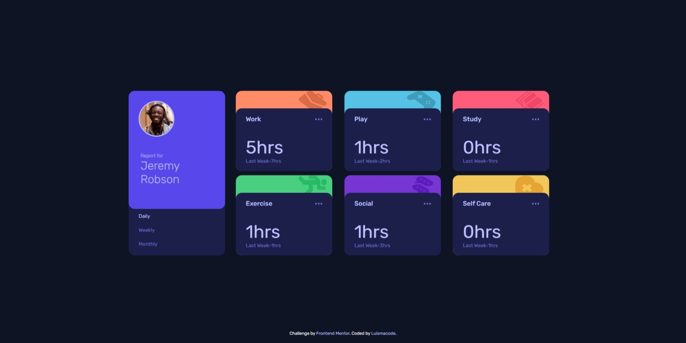
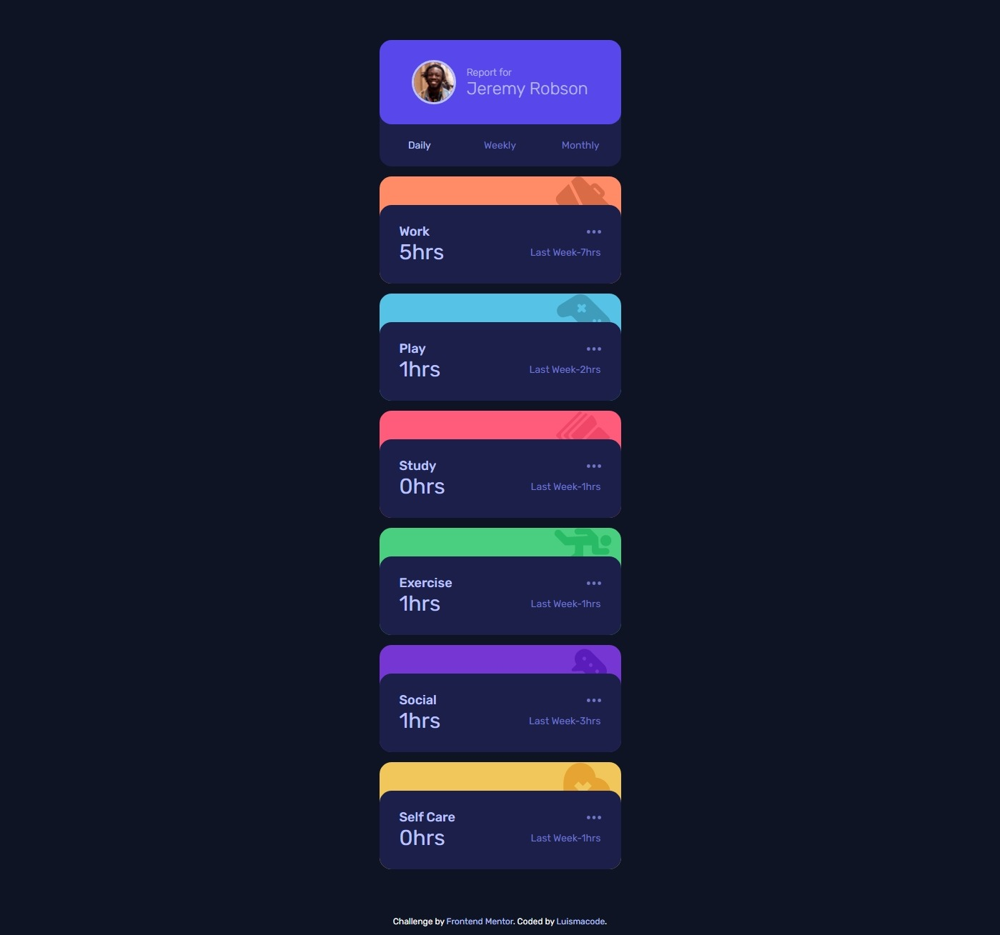

# Frontend Mentor - Time tracking dashboard solution

This is a solution to the [Time tracking dashboard challenge on Frontend Mentor](https://www.frontendmentor.io/challenges/time-tracking-dashboard-UIQ7167Jw). Frontend Mentor challenges help you improve your coding skills by building realistic projects.

## Table of contents

- [Overview](#overview)
  - [The challenge](#the-challenge)
  - [Screenshot](#screenshot)
  - [Links](#links)
- [My process](#my-process)
  - [Built with](#built-with)
  - [What I learned](#what-i-learned)
  - [Continued development](#continued-development)
  - [Useful resources](#useful-resources)
- [Author](#author)
- [Acknowledgments](#acknowledgments)

## Overview

### The challenge

Users should be able to:

- View the optimal layout for the site depending on their device's screen size
- See hover states for all interactive elements on the page
- Switch between viewing Daily, Weekly, and Monthly stats

### Screenshot




### Links

- Live Site URL: [live site](https://luismacode.github.io/time-tracking-dashboard/)

## My process

### Built with

- Semantic HTML5 markup
- CSS custom properties
- Utilities Classes
- Flexbox
- CSS Grid
- Mobile-first workflow
- BEM
- Javascript modules

### What I learned

Through the development of this challenge I learned:

1. Import a json or get the json by performing a fetch in javascript

  ```js
    import json from '.data/data.json' assert {type:'json'};
  ```

  ```js
    async function fetchJson() {
     return fetch("src/data/data.json")
    .then((res) => res.json())
    .then((data) => data);
  }
  ```

2. Use a tagged template to generate a string containing Html elements.

  ```js
    function html(strings, ...keys) {
    return function () {
    const temp = strings.slice();
    keys.forEach((key, i) => {
      temp[i] += key;
    });
      return temp.join("");
      };
    }
  ```

3. Import and call the tagged function in the index file like this.

  ```js
      const template = html`
      <article class="card">
        ........
      </article>
    `(data);
```

4. Convert a string template to a dom node to then add it as a child to the parent node.

  ```js
      const node = new DOMParser().parseFromString(template, "text/html").body.firstElementChild;
      parentNode.appendChild(node)
  ```

### Continued development

Note that the use of import assertions  only works in browsers with support it and at the time this challenge was finished is not supported in firefox. So if you run this code in firefox the user experience will be bad instead I recommend using google chrome or Microsoft Edge in its latest updated version.

Taking into account the above I just updated this repository and changed the use of import assertion and only use fetch to get the data from the json file.

### Useful resources

- [import-export-javascript](https://javascript.info/import-export)
- [Import-assertions](https://github.com/tc39/proposal-import-assertions)
- [tagged-template](https://developer.mozilla.org/en-US/docs/Web/JavaScript/Reference/Template_literals)
- [Dom-parser](https://davidwalsh.name/convert-html-stings-dom-nodes)
- [fetch-with-Json](https://dmitripavlutin.com/fetch-with-json/)

## Author

- Linkedin - [luismachaca](www.linkedin.com/in/luismachaca)
- Frontend Mentor - [@luismacode](https://www.frontendmentor.io/profile/luismacode)
- Twitter - [@luismacode](https://www.twitter.com/luismacode)

## Acknowledgments

At some point while I was developing, I stopped moving forward and got stuck and I felt that I needed to learn another way to face this challenge I happily found this [CodingTube](https://www.youtube.com/watch?v=52q6OGbcIso&list=WL&index=2) youtube video that was of great help to advance and finish this challenge, as well as free resources on the internet to review concepts in javascript.
